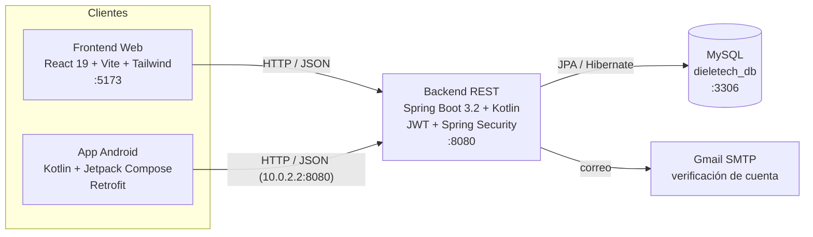

# DIELTECH — Plataforma de Aprendizaje Virtual

> **"Tu ruta hacia tu 1° en Tech"**

Plataforma de cursos de tecnología con tres clientes conectados a una misma API y base de datos:
**Backend (Spring Boot + Kotlin)**, **Frontend Web (React 19)** y **App Android (Jetpack Compose)**.

Proyecto del curso **Arquitectura de Software & Desarrollo de Aplicaciones para Dispositivos Convergentes** — UPC.
Metodología **SCRUM** (sprints de 1 semana). Autor: **Diego Betancur** + Claude como asistente técnico.

---

## Arquitectura



- El **Web** llama al backend en `http://localhost:8080`.
- El **Android** (emulador) llama al backend en `http://10.0.2.2:8080` (así el emulador ve el `localhost` del PC). Tiene *fallback* a datos locales si el backend no responde.
- Ambos comparten la **misma base MySQL**: una compra hecha en el celular aparece en "Mis Cursos" de la web con el mismo correo.

---

## Stack tecnológico

| Capa | Tecnologías |
|------|-------------|
| **Backend** | Java 21, Kotlin 1.9, Spring Boot 3.2, Spring Security, Spring Data JPA, JWT (jjwt), Gradle |
| **Base de datos** | MySQL 8 (`dieletech_db`) |
| **Frontend Web** | React 19, Vite, Tailwind CSS v4, React Router 7, Axios |
| **App Android** | Kotlin, Jetpack Compose (Material 3), Navigation Compose, Retrofit + Gson, Coroutines |
| **Auth** | Correo + contraseña, contraseñas con BCrypt, sesión con JWT |

---

## Estructura del repositorio (monorepo)

```
DIELTECH/
├── dieletech-backend/     # API REST (Spring Boot + Kotlin)
│   └── src/main/resources/application.properties.example  # plantilla de config
├── dieletech-frontend/    # Web (React 19 + Vite)
├── dieletech-android/     # App móvil (Kotlin + Compose)
├── docs/                  # Documentación adicional
├── setup-mysql.ps1        # Instalador de MySQL Server (Windows)
└── README.md
```

---

## Cómo ejecutar todo (Windows)

### Requisitos
- **JDK 21** (o 17+), **Node.js 18+**, **Android Studio** (con un emulador, ej. Pixel 7), **MySQL Server 8**.

### 1) Base de datos (MySQL)
Si no tienes MySQL Server instalado, ejecuta el instalador incluido en una **PowerShell como Administrador**:
```powershell
Set-ExecutionPolicy Bypass -Scope Process -Force
& ".\setup-mysql.ps1"
```
Deja MySQL corriendo en `localhost:3306` con la base `dieletech_db`. Usa tu propio usuario y contraseña, y colócalos en `application.properties` (copia `application.properties.example` como plantilla).

### 2) Backend (Spring Boot)
```powershell
cd dieletech-backend
# Primera vez: copia la plantilla y ajusta los secretos
copy src\main\resources\application.properties.example src\main\resources\application.properties
.\gradlew bootRun
```
Espera `Started BackendApplicationKt`. La API queda en `http://localhost:8080`.
Verifica: abre `http://localhost:8080/api/courses` → debe devolver 6 cursos en JSON.

### 3) Frontend Web (React)
```powershell
cd dieletech-frontend
npm install      # solo la primera vez
npm run dev
```
Abre `http://localhost:5173`.

### 4) App Android
1. Abre `dieletech-android` en **Android Studio**.
2. **Sync Project with Gradle Files**.
3. Enciende un emulador (Pixel 7) y presiona **Play ▶**.
> El emulador accede al backend por `10.0.2.2:8080` (equivale a `localhost` del PC). El backend debe estar corriendo.

---

## Configuración y secretos

- El archivo real `dieletech-backend/src/main/resources/application.properties` **NO se sube al repo** (está en `.gitignore`) porque contiene la contraseña de aplicación de Gmail y el secreto JWT.
- Usa `application.properties.example` como plantilla: cópialo a `application.properties` y coloca tus valores.
- **Verificación por correo**: en desarrollo `app.auto-verify=true` deja las cuentas activas al instante (login inmediato). Para exigir verificación real por correo, pon `app.auto-verify=false` y configura una contraseña de aplicación de Gmail.

Credenciales de desarrollo (locales):

| Servicio | Valor |
|----------|-------|
| MySQL | tu usuario y contraseña locales — base `dieletech_db` |
| Backend | puerto `8080` |
| Frontend | puerto `5173` |

---

## API REST (resumen)

Base: `http://localhost:8080`

### Autenticación — `/api/auth`
| Método | Ruta | Descripción |
|--------|------|-------------|
| POST | `/register` | Registro `{name,email,password}`. Envía correo de verificación (auto-verifica en dev). |
| GET | `/verify?token=` | Verifica la cuenta desde el enlace del correo. |
| POST | `/login` | Login `{email,password}` → `{token,name,email,role}` (JWT). |
| POST | `/forgot-password` | Solicita enlace de recuperación `{email}`. |
| POST | `/reset-password` | Cambia la contraseña `{token,password}`. |

### Cursos — `/api/courses` (público)
| Método | Ruta | Descripción |
|--------|------|-------------|
| GET | `/` | Lista de cursos. |
| GET | `/{id}` | Detalle de un curso (temario, requisitos). |
| GET | `/technology/{tech}` | Filtra por tecnología. |
| GET | `/search?q=` | Búsqueda. |

### Compras — `/api/purchases`
| Método | Ruta | Descripción |
|--------|------|-------------|
| POST | `/` | Registra compra `{courseId,fullName,email,paymentMethod,amount}`. |
| GET | `/user/{email}` | Compras (inscripciones) de un usuario. |
| GET | `/check?courseId=&email=` | ¿El usuario ya compró el curso? |

---

## Modelo de datos (MySQL)

| Tabla | Campos principales |
|-------|--------------------|
| **users** | id, name, email (único), password (BCrypt), verified, verification_token, reset_token, reset_token_expiry, role, created_at |
| **courses** | id, title, description, technology, level, price, duration, image_url, student_count, curriculum, prerequisites, preview_video_url |
| **purchases** | id, course_id, user_email, full_name, amount, payment_method, order_id (único), status, purchased_at |

`Role`: `STUDENT`, `INSTRUCTOR`, `ADMIN`. Las tablas se crean solas con `spring.jpa.hibernate.ddl-auto=update`.

---

## Roles de usuario y flujo

- **Visitante** — navega el catálogo sin registrarse.
- **Estudiante nuevo** (HU-01) — se registra.
- **Estudiante registrado** (HU-02, HU-03) — inicia sesión / verifica cuenta / recupera contraseña.
- **Comprador** (HU-05, HU-06) — ve detalle de un curso y lo compra.
- **Estudiante inscrito** (HU-07, HU-08, HU-10, HU-11) — accede a "Mis Cursos" y avanza en las lecciones (progreso).

Flujo web: `Catálogo → Detalle → Checkout → Compra exitosa → Mis Cursos → Lección (progreso)`.
Flujo Android: `Login/Registro → (barra inferior) Inicio · Catálogo · Mis Cursos · Perfil → Detalle → Checkout → Éxito`.

---

## Historias de usuario cubiertas (hasta Sprint 3)

| HU | Descripción | Web | Android |
|----|-------------|-----|---------|
| HU-01 | Registro de estudiante | ✅ | ✅ |
| HU-02 | Inicio de sesión (JWT) | ✅ | ✅ |
| HU-03 | Verificación de cuenta / recuperar contraseña | ✅ | ✅ (login/registro) |
| HU-04/05 | Catálogo y detalle de cursos | ✅ | ✅ |
| HU-06 | Compra de curso (persistida en MySQL) | ✅ | ✅ |
| HU-07/08/10/11 | Mis cursos inscritos + progreso | ✅ | ✅ (Mis Cursos) |

---

## Solución de problemas (troubleshooting)

- **La web se ve como "texto plano"** → faltaba el plugin de Tailwind v4 en Vite. Ya está en `vite.config.js` (`@tailwindcss/vite`) e `index.css` usa `@import "tailwindcss";`.
- **La app Android crashea al abrir un curso** (`NoSuchMethodError` en `CircularProgressIndicator`) → era el `compose-bom:2024.01.00` (material3 desalineado). Corregido a `2024.02.00` en `dieletech-android/app/build.gradle.kts`.
- **`Failed to fetch` / la app no ve el backend** → verifica que el backend esté corriendo; en Android usa `10.0.2.2:8080`, no `localhost`.
- **MySQL no conecta** → confirma el servicio `MySQL80` corriendo y la base `dieletech_db` creada (usa `setup-mysql.ps1`).
- **Puertos ocupados** → 8080 (backend), 5173 (frontend), 3306 (MySQL).

---

## Licencia

Proyecto académico (UPC). Uso educativo.
